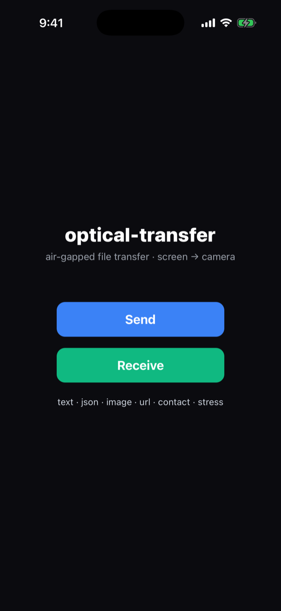
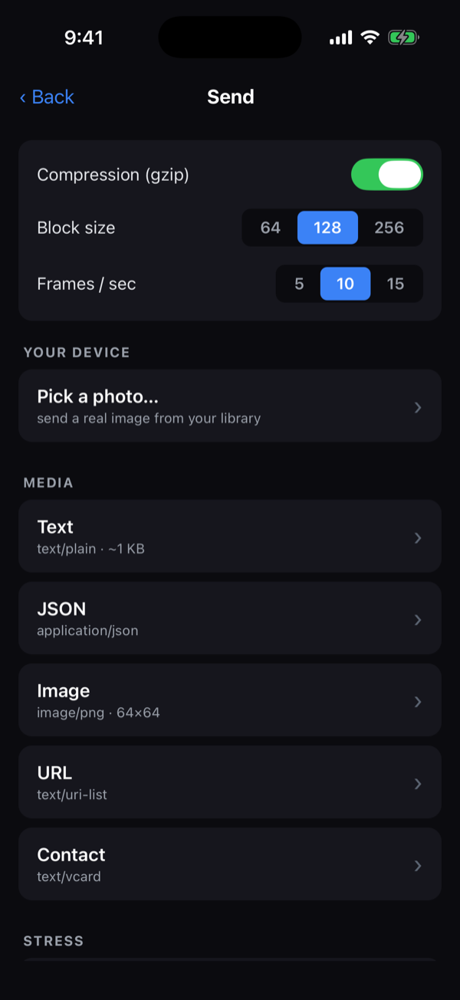
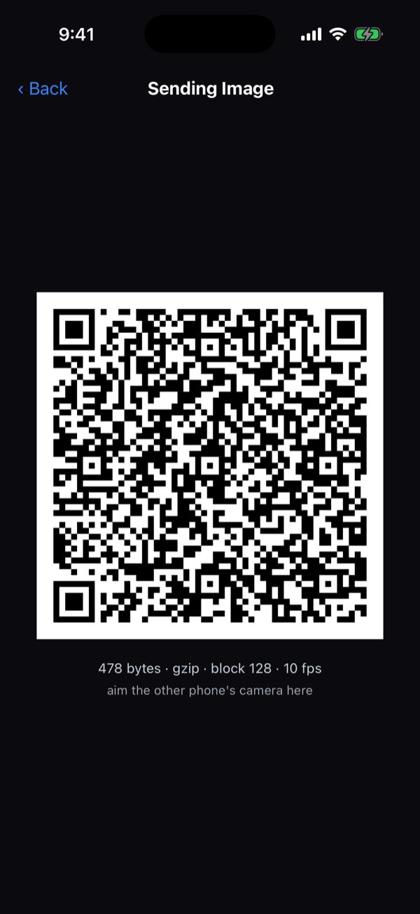
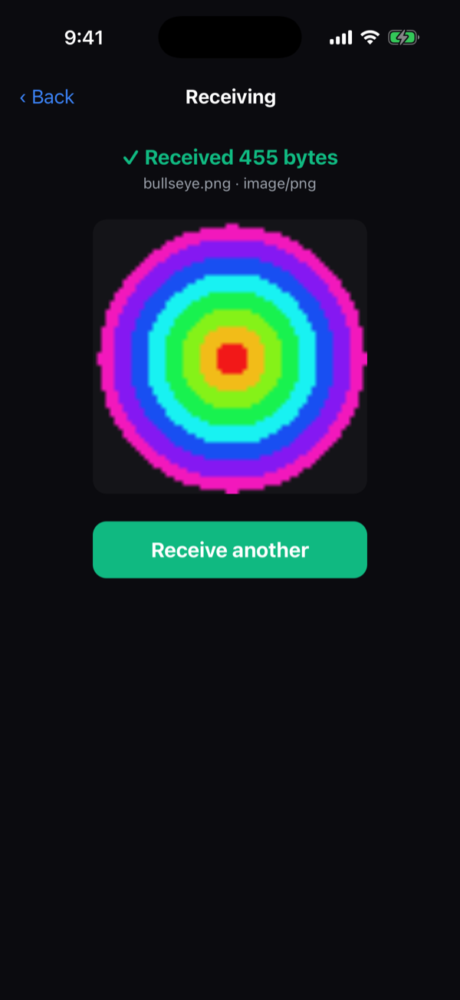
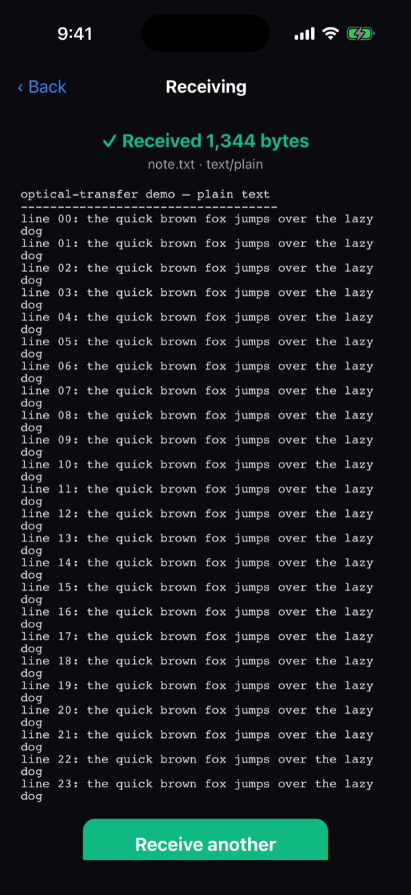

# optical-transfer

[](LICENSE)
[](packages/core)
[](packages/react-native)
[](#status)
[](https://tristanheilman.github.io/react-native-optical-transfer/docs/viewer/)

Air-gapped, one-way file transfer over **screen → camera**. One device animates a
stream of QR codes; another films the screen and reconstructs the file. No network,
no pairing, no handshake, no special permissions.

> ### ▶ [Try the live GIF viewer](https://tristanheilman.github.io/react-native-optical-transfer/docs/viewer/)
> Drop a shared **[optical-transfer GIF](#shareable-gif-transfer)** and get the file back — right in your browser, nothing uploaded. Make one on a phone (**Share as GIF**) or in the viewer's **Make a GIF** tab.

The transport is built on **LT (Luby transform) fountain codes**: each QR frame carries
the XOR of a pseudo-random subset of the file's blocks, chosen deterministically from
the frame's sequence number. The receiver collects **any** ~`k·1.15` distinct frames, in
any order, and peels the file out of them. A dropped or blurred frame costs a little
time, never correctness — so there is no back-channel and no retransmission.

This repo is packaging that transport as reusable libraries so mobile (and web) apps
can drop it in however they choose.

## Packages

| Package | Status | What it is |
| --- | --- | --- |
| [`@optical-transfer/core`](packages/core) | ✅ working, tested | Pure, dependency-free transport: `OpticalSender`, `OpticalReceiver`, fountain codec + frame protocol. Runs on Node, browsers, and React Native (Hermes). |
| [`@optical-transfer/react-native`](packages/react-native) | ✅ iOS device-validated | Sender/receiver components: animated byte-mode QR (`react-native-qrcode-svg`) + camera capture (`react-native-vision-camera` v5). Includes a bare-RN example app. Send + receive verified on real iPhones. |
| [`@optical-transfer/gif`](packages/gif) | ✅ working, tested | Encode a file as a **shareable animated GIF** of QR frames, and decode a GIF back into the file — asynchronous, offline transfer. Powers the [web viewer](docs/viewer/index.html). |

## The example app

The repo ships a bare **React Native** example (`packages/react-native/example`) — a small
test bench for the transport: pick a media type (or a real photo), tune the transport
(compression, block size, fps), broadcast it as an animated QR stream, and watch another
phone's camera rebuild it. Screens below are iOS (iPhone, iOS 26):

<!--
  DEMO — a screen-capture of a real two-device transfer (a Rick Astley clip sent
  screen → camera). Add the file at docs/demo.mp4, then replace this comment with:
  <p align="center">
    <video src="docs/demo.mp4" controls width="640" poster="docs/screenshots/03-sending.png"></video>
    <br><sub>A real transfer: one phone broadcasts an animated QR stream, the other's camera reconstructs the file — no network involved.</sub>
  </p>
-->

<table>
  <tr>
    <td align="center" width="20%"><br><sub><b>Menu</b><br>send or receive</sub></td>
    <td align="center" width="20%"><br><sub><b>Send</b><br>pick content · tune transport</sub></td>
    <td align="center" width="20%"><br><sub><b>Broadcasting</b><br>animated QR stream</sub></td>
    <td align="center" width="20%"><br><sub><b>Received image</b><br>rebuilt from frames</sub></td>
    <td align="center" width="20%"><br><sub><b>Received text</b><br>verified & rendered</sub></td>
  </tr>
</table>

**Platforms:** iOS is device-validated end-to-end (send + receive). On **Android**, the
**send** side (animated QR display) works today; **receive** (QR scanning) is iOS-first in
Vision Camera v5 and is on the roadmap. See
[running the example](packages/react-native#running-the-example-app-ios).

## Shareable GIF transfer

Beyond the live screen→camera channel, a file can be packed into a **shareable
animated GIF** of QR frames ([`@optical-transfer/gif`](packages/gif)). This makes
transfer **asynchronous** — post the GIF anywhere and anyone reconstructs the file,
no two devices in a room. Because the frames are generated (not filmed), decode is
near-perfect, and fountain coding still tolerates a few frames mangled by re-encoding.

- **Make a GIF** on a phone (Share as GIF) or in the browser.
- **Decode a GIF** with the self-contained **[web viewer](docs/viewer/index.html)** —
  drop a GIF, get the file back; nothing is uploaded, it all runs client-side.

## Core API

```ts
import { OpticalSender, OpticalReceiver } from "@optical-transfer/core";

// Sender — turn a file into an endless stream of self-describing frame bytes.
const tx = new OpticalSender(fileBytes, { blockLen: 256 });
for (const frame of tx.stream()) {
  renderAsQr(frame); // hand `frame` (Uint8Array) to any byte-mode QR renderer
}

// Receiver — feed decoded QR bytes; it locks on mid-stream and self-verifies.
const rx = new OpticalReceiver();
onQrScanned((bytes) => {
  rx.ingest(bytes);
  updateProgressBar(rx.progress); // frames-collected, not blocks-solved
  if (rx.isComplete) saveFile(rx.result!); // FNV-1a verified before exposed
});
```

The core touches no DOM, canvas, camera, or QR pixels — it only turns `seq` numbers
into frame bytes and frame bytes back into a file. Platform layers supply the pixels
and the camera.

## Development

```bash
npm install
npm test         # runs the core round-trip suite (lossy + reordered channel)
npm run build    # emits packages/core/dist
```

The test suite drives the sender's frame bytes straight into the receiver through a
simulated channel that drops 30% of frames and reorders the rest — no camera required —
covering mid-stream lock-on, session restarts, a range of file/block sizes, checksum
verification, and overhead bounds.

## Status

- ✅ **Core transport** — `OpticalSender` / `OpticalReceiver`, fountain codec, and frame
  protocol. Unit-tested over a simulated lossy/reordered channel; builds clean.
- ✅ **React Native layer** — sender/receiver components + example app. Typechecks against
  the real native libs and the example bundles under Metro.
- ✅ **On-device iOS** — validated end-to-end on real iPhones (iOS 26 and iOS 16): the
  animated-QR sender and the Vision Camera **v5** receiver reconstruct files screen → camera.
- 🟡 **Android send** — the animated-QR sender is cross-platform and works on Android.
- ⏳ **Android receive** — v5 QR scanning is iOS-first; a fallback is future work.

The binary-safe QR round-trip (the original sharp edge — scanners hand back UTF-8, not raw
bytes) is solved by carrying each frame as **base64 text** inside the QR, so any off-the-shelf
renderer and scanner round-trip it exactly, at ~33% density cost.

### What's next

- ✅ **Done — on-device iOS.** Sender + Vision Camera v5 receiver validated on real iPhones
  (iOS 26 and iOS 16); the example app ships a QR/optical-themed icon.
- ✅ **Done — compress the payload before encoding.** Optional, pluggable codecs (a 1-byte
  self-describing envelope); the RN package ships a `gzipCodec` (pako). Fewer blocks →
  faster transfer for compressible data; auto-skipped when it wouldn't help.
- Android **receive** (a QR-scanning path that isn't v5-iOS-only) — the sender already
  works cross-platform.
- Optional filename/MIME metadata in **core** (the example already layers its own
  `mime\nfilename\nbytes` envelope on top; see `example/src/payload.ts`).
- Optionally swap the base64-over-text channel for a raw-bytes frame processor to recover
  the ~33% density and push throughput.

## Prior art & related work

Air-gapped QR file transfer is an idea several people have reached independently. Two
projects are worth knowing — both MIT licensed:

- **[decimen-optical-transfer](https://github.com/bashalarmistalt/decimen-optical-transfer)**
  — the proof-of-concept this project's fountain codec and frame protocol are *derived from*
  (see [Attribution](#attribution--license)).
- **[mohankumarelec/airgapped-qr-code-transfer](https://github.com/mohankumarelec/airgapped-qr-code-transfer)**
  — an earlier, independent web app (Vue) demonstrating the same screen → camera concept. It
  gzip-compresses the file (`pako`), then streams fixed-size **indexed chunks** as sequential
  QR codes and reassembles them by index.

The core difference is resilience: that project uses **naive indexed chunking** — the
receiver must capture every specific chunk in a single pass, so a missed frame means starting
over. This project uses **LT fountain codes**, so the receiver reconstructs from *any* ~k·1.15
frames in any order and tolerates dropped frames without retransmission. Its best idea —
**compressing the payload before encoding** — we adopted: optional pluggable codecs with a
`gzipCodec` on React Native (see [What's next](#whats-next)). No code from that project is
used here; it is acknowledged as independent prior art.

## Attribution & license

This project is **MIT licensed** (see [`LICENSE`](LICENSE)).

The fountain codec (`fountain.ts`) and frame protocol (`protocol.ts`) are derived from
the [`decimen-optical-transfer`](https://github.com/bashalarmistalt/decimen-optical-transfer)
proof-of-concept, which is itself MIT licensed (Copyright © 2026 BashAlarmist). We comply
by preserving the upstream copyright and permission notice in
[`THIRD-PARTY-NOTICES.md`](THIRD-PARTY-NOTICES.md) and in each derived file's header — the
only obligation MIT imposes. Everything else in this repo (`sender.ts`, `receiver.ts`,
tests, packaging) is original and offered under the same MIT terms.
