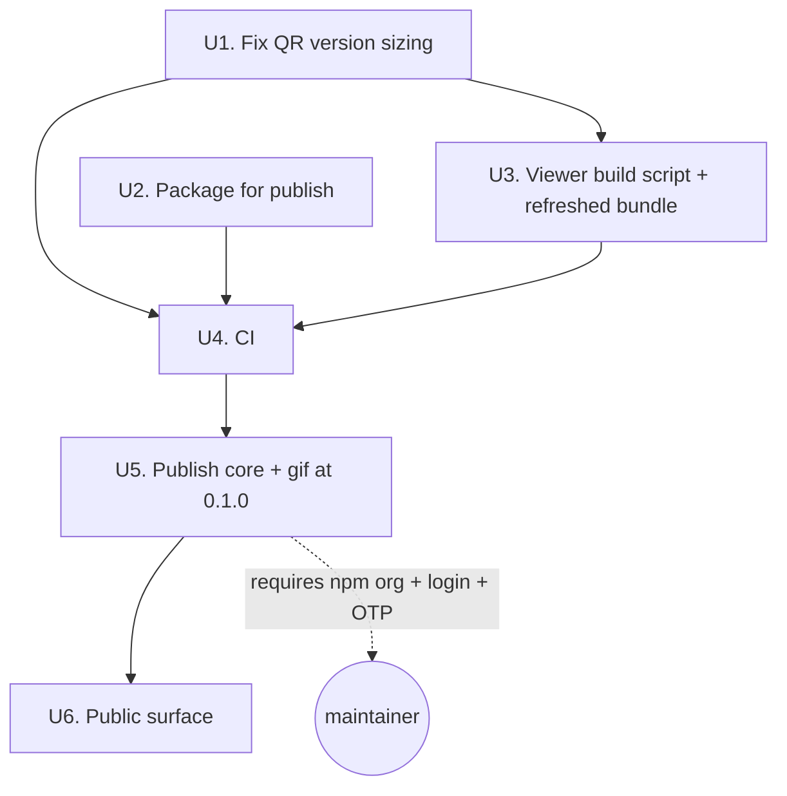

# npm Release Prep and First Publish - Plan

## Goal Capsule

- **Objective:** Fix the confirmed encoder defect, put the packages in a publishable state, publish `@optical-transfer/core` and `@optical-transfer/gif` at 0.1.0, and give the project the public surface a stranger needs to use and contribute to it.
- **Authority:** Requirements (R-IDs) govern behavior. Key Technical Decisions (KTD-IDs) govern mechanism. Unit Approach fields carry unit-local detail only.
- **Execution profile:** Fix and verify before publishing. Anything that reaches npm must have passed CI first, because npm's 72-hour unpublish window makes a bad release expensive to walk back.
- **Stop conditions:**
  - Stop before U5 if CI is not green on `main`.
  - Stop and ask if the `optical-transfer` npm org name is unavailable — KTD1 reopens.
  - Stop and ask if the U1 fix changes how previously-generated GIFs decode.
- **Tail ownership:** U5 requires npm credentials and a possible 2FA one-time code that only the maintainer can supply. Every other unit is fully automatable.

---

## Product Contract

### Summary

Ship the first public release of optical-transfer. Fix the QR-version defect in the GIF encoder, wire real dependency ranges and a build-on-publish step into the packages, add CI, publish core and gif at 0.1.0, and add the changelog, contributor guidance, and stability statement that make the project joinable.

### Problem Frame

The repository presents as finished but is not releasable. `encodeGif` throws on roughly half of all invocations, which breaks the two features the README leads with: "Share as GIF" in the example app and "Make a GIF" in the hosted viewer. The failure is intermittent, so it survived manual testing.

Underneath that, nothing is set up to publish. All three packages sit at `0.0.0`, two of them depend on `@optical-transfer/core` through a `*` wildcard that means "whatever npm says is latest" once published, and `dist/` is gitignored with no build wired into the publish path — so a bare `npm publish` today would ship a package with no compiled output. There is no CI, so none of this is caught automatically. There is also no changelog, no contributor guidance, and no statement of what "experimental" means for versioning, which leaves an interested stranger with no way in.

### Requirements

**Correctness**

- R1. GIF encoding succeeds for every payload and session id, not only those whose first frame happens to need the largest QR version.
- R2. The hosted viewer bundle carries the encoder fix.

**Packaging**

- R3. Published packages declare resolvable semver dependency ranges instead of workspace wildcards.
- R4. Publishing a package always ships its built output.
- R5. `@optical-transfer/core` and `@optical-transfer/gif` are published at 0.1.0 under the `@optical-transfer` npm org, with a matching git tag.

**Automation**

- R6. Every push and pull request installs, builds, typechecks, and tests all workspaces.
- R7. CI fails when the committed viewer bundle differs from a fresh build.

**Public surface**

- R8. A changelog records what changed in each released version.
- R9. A contributor can learn how to run the project, what a useful decode-failure report contains, and how to submit a change, without reading the source.
- R10. The README points at the published packages and states what `experimental` means for versioning.

### Scope Boundaries

#### Deferred to Follow-Up Work

- Publishing `@optical-transfer/react-native`. It ships raw TypeScript with no build step and its Android receive path is unimplemented; releasing it now would document a gap in a shipped package.
- Android receive.
- Replacing the base64-over-text frame channel with raw bytes.
- Filename and MIME metadata in core.
- Release tooling (changesets, release-it) — see KTD4.

#### Non-goals

- Renaming the project or its packages. Core and gif are platform-neutral and the hosted viewer depends on gif (KTD5).
- Changing the GIF wire format or the frame protocol. The U1 fix must leave existing GIFs decodable.

---

## Planning Contract

### Key Technical Decisions

- KTD1. Publish under the `@optical-transfer` scope, backed by a newly created free npm organization. (session-settled: user-approved — chosen over publishing under the `@tristanheilman` username scope or unscoped names: it keeps package identity tied to the project rather than a personal account, so maintainers can be added later without renaming.) Governs R5.
- KTD2. Release core and gif; hold the React Native package back. (session-settled: user-approved — chosen over publishing all three at once: the RN package has no build step and no Android receive path, so releasing it would set an expectation that would have to be walked back.) Governs R5.
- KTD3. Size the GIF canvas from the largest QR version any frame needs, and render every frame at that version. `QRCode.create` selects a version from *content* through its segment optimizer, not from payload length. Frame payload length is constant (`HEADER_LEN` + `blockLen`), but frame content varies with the randomly derived session id, so the first frame's version is not an upper bound. Taking the maximum across all frames keeps GIF dimensions uniform, which the frame writer requires. Governs R1.
- KTD4. Publish with npm's own commands and a short written procedure, rather than adding release tooling. Two published packages and one maintainer do not yet justify changesets or release-it, and either can be adopted later without undoing this. Governs R5.
- KTD5. The project keeps its generic name. (session-settled: user-approved — chosen over renaming to `react-native-optical-transfer`: core is dependency-free and platform-neutral, gif has no React Native involvement, and the hosted viewer depends on gif.)
- KTD6. Rebuild packages through the `prepack` lifecycle script. `dist/` is gitignored, so build output is never in the tree npm packs from; running the build as a lifecycle step removes the chance of shipping stale or missing output. `prepack` is chosen over `prepublishOnly` because it runs for both `npm pack` and `npm publish` — verified in this repo's npm 10.8.2, where `npm pack --dry-run` executes `prepack` and skips `prepublishOnly`. That makes the pack check in U2 a real proof of publish behavior rather than a check that passes only when a build happens to be lying around. Governs R4.

### High-Level Technical Design

Unit dependency order, and where the maintainer-only gate sits:

Publish order within U5 is `core` then `gif`: gif declares `@optical-transfer/core` at `^0.1.0`, so core must exist on the registry first for a consumer's install to resolve.

### Risks & Dependencies

- The `optical-transfer` npm organization may not exist yet and must be created before U5. Automated checks against npmjs.com return 403 to non-browser requests, so this is unconfirmed from here. If the org name is taken, KTD1 reopens before any publish.
- npm allows unpublishing only within 72 hours. A wrong package name or a broken tarball discovered after that requires a new version, not a correction in place. This is why U5 sits behind green CI and a fresh-project install check.
- The U1 fix raises the QR version for the sessions that previously threw, which makes those GIFs slightly larger in pixel dimensions. Previously-generated GIFs stay decodable — `jsQR` reads any version — but the change should be confirmed, not assumed.
- Two-factor authentication on the npm account prompts for a one-time code during publish. It cannot be supplied from an automated session.

### Open Questions

- Deferred: reserve `react-native-optical-transfer` on npm as a thin re-export of the scoped package, for React Native directory discoverability? Not needed until the RN package publishes, and it adds a package to every future release.

---

## Implementation Units

### U1. Size GIF frames from the largest QR version any frame needs

- **Goal:** `encodeGif` succeeds for every session id, not only the roughly half whose first frame needs the largest version.
- **Requirements:** R1
- **Dependencies:** none
- **Files:** `packages/gif/src/encode.ts`, `packages/gif/test/roundtrip.test.ts`
- **Approach:**
  1. Build every frame's base64 string first, as the current code already does.
  2. Create each frame's QR with automatic version selection to learn the version that frame needs, and take the maximum.
  3. Size the canvas from the maximum-version symbol rather than from the first frame's.
  4. Render every frame at that maximum version.
  5. Replace the comment above the sizing block. It currently asserts that equal payload length implies a shared version, which is the wrong premise behind the bug; state instead that the version depends on content through the segment optimizer.
- **Execution note:** Reproduce first with a seeded failing test. The bug is intermittent under randomly derived session ids, so a fix without a deterministic repro cannot be shown to work.
- **Patterns to follow:** the options-and-defaults block at the top of `encodeGif`; the existing round-trip assertions in the test file.
- **Test scenarios:**
  - A session id whose first frame needs a smaller version than a later frame encodes without throwing and round-trips to the original bytes. Find the seed by sweeping session ids during the repro step and pin it in the test.
  - Encoding across a sweep of at least 100 fixed session ids never throws.
  - Every frame in a produced GIF matches the reported `width` and `height`.
  - A payload whose frames all need the same version produces the same dimensions as before the change, so the common case does not regress.
  - The four existing round-trips (UTF-8 text, incompressible binary, compression codec, missing-codec error) still pass.
- **Verification:** the gif suite passes on repeated consecutive runs, not on a single run.

### U2. Prepare the packages for publish

- **Goal:** the packages carry resolvable versions, real dependency ranges, and a build that runs at publish time.
- **Requirements:** R3, R4, R5
- **Dependencies:** none
- **Files:** `packages/core/package.json`, `packages/gif/package.json`, `packages/react-native/package.json`, `packages/core/LICENSE`, `packages/gif/LICENSE`
- **Approach:**
  1. Set `version` to `0.1.0` in all three packages. React Native takes the version too, so the workspace stays coherent, even though KTD2 holds it back from publishing.
  2. Replace `"@optical-transfer/core": "*"` with `"^0.1.0"` in gif and react-native. npm workspaces still link the local package, because its version satisfies the range.
  3. Add `prepack` to core and gif, running that package's build (KTD6).
  4. Copy the root MIT `LICENSE` into `packages/core/` and `packages/gif/`. npm includes a LICENSE only when it sits inside the package directory.
- **Test expectation:** none — packaging metadata with no behavior of its own. The pack check under Verification is the proof.
- **Verification:** `npm pack --dry-run` for core and gif lists compiled `dist/` output and the LICENSE; a clean `npm ci` still links core locally and the workspace build and tests pass.

### U3. Add a viewer build script and refresh the bundle

- **Goal:** the hosted viewer carries the U1 fix, and rebuilding it is a named command rather than tribal knowledge.
- **Requirements:** R2
- **Dependencies:** U1
- **Files:** `package.json`, `docs/viewer/index.html`
- **Approach:**
  1. Add a root `build:viewer` script that runs `web/viewer/build.mjs`. The viewer is not an npm workspace, so the root `build` script does not currently reach it.
  2. Declare `esbuild` as a root devDependency. `web/viewer/build.mjs` imports it, but no manifest declares it — it resolves today only as a transitive dependency of `tsx`, so a `tsx` upgrade could break the viewer build.
  3. Regenerate `docs/viewer/index.html`, which is the build output GitHub Pages serves.
- **Test expectation:** none — build wiring. U4's drift check is the standing proof that the committed bundle stays current.
- **Verification:** the regenerated viewer makes and decodes a GIF in a browser without the version error.

### U4. Continuous integration

- **Goal:** a red suite or a stale viewer bundle can never reach a release again.
- **Requirements:** R6, R7
- **Dependencies:** U1, U2, U3
- **Files:** `.github/workflows/ci.yml`
- **Approach:**
  1. Trigger on pushes to `main` and on every pull request. This covers fork PRs while keeping a same-repo push and its PR from running the same commit twice. Use Node 20 to match the root `engines` field, and `npm ci` for a clean install.
  2. Run build, typecheck, and test across all workspaces.
  3. Rebuild the viewer and fail if `docs/viewer/index.html` differs from the committed copy. This assumes esbuild's minified output is byte-identical between a local macOS build and CI's Linux build at the version `npm ci` pins. If it proves not to be, downgrade the gate to building the viewer without diffing, and drop R7.
  4. Rely on U1's session-id sweep for intermittency coverage rather than repeating the suite — the sweep makes a single run sufficient.
- **Test scenarios:**
  - The workflow fails when a test is deliberately broken.
  - The workflow fails when the committed viewer bundle is stale relative to a fresh build.
  - The workflow passes on a clean tree.
- **Verification:** the workflow runs green on a pull request, and its status badge resolves.

### U5. Publish core and gif at 0.1.0

- **Goal:** both packages are installable from npm and prove out in a project that is not this repo.
- **Requirements:** R5
- **Dependencies:** U1, U2, U3, U4
- **Files:** `docs/RELEASING.md`
- **Prerequisites (maintainer):** create the free `optical-transfer` organization on npmjs.com; `npm login`; have the 2FA one-time code available if enabled.
- **Approach:**
  1. Confirm CI is green on `main`.
  2. Publish `@optical-transfer/core`, then `@optical-transfer/gif`. Order matters: gif's dependency range must resolve against a published core.
  3. Tag `v0.1.0` and push the tag.
  4. Write `docs/RELEASING.md` with the procedure, so the next release does not re-derive it (KTD4).
- **Test expectation:** none — this is a release action. The install smoke check under Verification is the proof.
- **Verification:** in a scratch project outside this repository, installing both packages from npm and encoding then decoding a GIF returns the original bytes.

### U6. Public-facing surface

- **Goal:** someone who finds the project can tell what changed, what stability to expect, and how to report a decode failure.
- **Requirements:** R8, R9, R10
- **Dependencies:** U5
- **Files:** `CHANGELOG.md`, `CONTRIBUTING.md`, `.github/ISSUE_TEMPLATE/bug_report.md`, `README.md`
- **Approach:**
  1. Add a changelog in Keep a Changelog shape with a 0.1.0 entry covering the first publish and the encoder fix.
  2. Add contributor guidance: setup, the test and build commands, and what a useful decode-failure report contains — payload size, block length, device, and whether the failure was on the GIF path or the live camera path.
  3. Add a bug-report issue template that asks for those same fields.
  4. Update the README: replace the hand-made core and react-native badges with npm version badges, add the CI badge, and state what `experimental` means for versioning — pre-1.0, a minor version may change the wire format.
- **Test expectation:** none — documentation.
- **Verification:** the README badges resolve against the published versions and a green CI run.

---

## Verification Contract

| Command | Applies to | Gate |
|---|---|---|
| `npm ci` | all | clean install resolves the workspace links |
| `npm test` | U1, U2 | every workspace suite passes |
| `npm run build` | U2 | core and gif emit `dist/` |
| `npm run typecheck` | all | no type errors, including react-native |
| `npm run build:viewer` then `git diff --exit-code docs/viewer/index.html` | U3, U4 | the committed bundle matches a fresh build |
| `npm pack --dry-run -w @optical-transfer/core` and `-w @optical-transfer/gif` | U2 | each tarball contains `dist/` output and a LICENSE |
| install both packages in a scratch project and round-trip a GIF | U5 | the published artifacts work outside this repo |

The gif suite must be run more than once when verifying U1. A single green run was the condition that let this defect ship.

---

## Definition of Done

**Global**

- Every gate in the Verification Contract passes.
- CI is green on `main`.
- `@optical-transfer/core` and `@optical-transfer/gif` are installable from npm at 0.1.0, and `v0.1.0` is tagged and pushed.
- No experimental or dead-end code from abandoned approaches remains in the diff.

**Per unit**

| Unit | Done when |
|---|---|
| U1 | The seeded repro test fails before the fix and passes after; the session-id sweep passes; existing round-trips still pass. |
| U2 | `npm pack --dry-run` shows built output and a LICENSE for core and gif; no `*` dependency ranges remain. |
| U3 | `npm run build:viewer` exists and `docs/viewer/index.html` matches a fresh build. |
| U4 | The workflow passes on a clean tree and fails on both a broken test and a stale viewer bundle. |
| U5 | A scratch project outside this repo installs both packages and round-trips a GIF; `docs/RELEASING.md` records the procedure. |
| U6 | Changelog, contributor guidance, and issue template exist; README badges resolve and the stability statement is explicit. |
